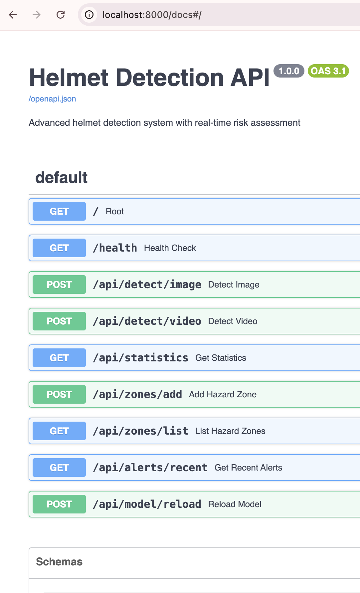
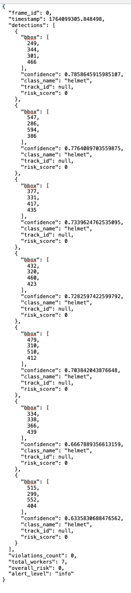
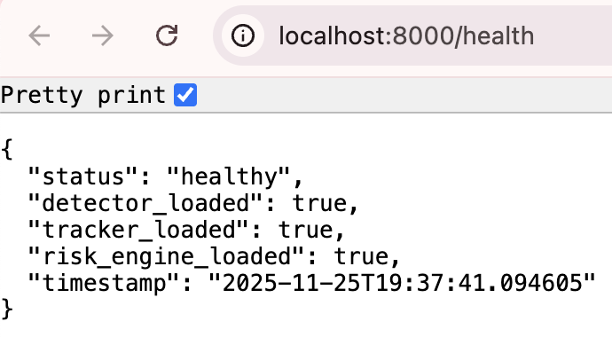

# Helmet Detection System

A computer vision system that detects construction workers and whether they're wearing safety helmets. Built this to explore real-time object detection and learn about production ML pipelines.



## What It Does

The system takes images or video of construction sites and:
- Detects people in the frame
- Identifies if they're wearing helmets
- Tracks individuals across video frames
- Calculates risk scores based on multiple factors (location, duration, history)

### Live Detection Example



In this test, it detected 7 workers - all wearing helmets with 63-78% confidence.

## Why I Built This

Wanted to go beyond tutorial projects and build something that could actually work in production. This meant dealing with:
- Real-time video processing
- Keeping track of people across frames (not just detecting them once)
- Designing a system that doesn't just say "detected/not detected" but provides context
- Making it deployable with Docker and proper APIs

## The Interesting Part: Risk Assessment

Most helmet detection projects just detect and alert. I added a risk scoring system that considers:
```
Risk Score = 
    35% × How close to dangerous areas (scaffolding, machinery)
  + 25% × How long the violation lasts
  + 20% × How many people are around (more people = higher impact)
  + 20% × Person's past compliance
```

This reduces false positives significantly - you don't want alerts every time someone briefly lifts their helmet.

## Tech Stack

**Core Detection:**
- YOLOv8 for object detection
- DeepSORT for tracking people across frames
- OpenCV for video processing

**Backend:**
- FastAPI for the REST API
- PostgreSQL + TimescaleDB (optimized for time-series data)
- Redis for caching
- Celery for background tasks

**Deployment:**
- Docker Compose for all services
- Prometheus + Grafana for monitoring

## Quick Start
```bash
# Clone
git clone https://github.com/harjeet-chahal/helmet-detection-system.git
cd helmet-detection-system

# Create environment file
cp .env.example .env

# Start everything
docker-compose up -d

# Access API docs
open http://localhost:8000/docs
```

The API will be at `http://localhost:8000/docs` - you can upload images directly there.

## Project Structure
```
src/
├── detection/
│   ├── yolo_detector.py    # YOLOv8 wrapper with custom features
│   └── tracker.py          # DeepSORT tracking implementation
├── risk_assessment/
│   └── risk_engine.py      # Risk scoring algorithm
├── api/
│   └── main.py             # FastAPI server
└── database/
    └── models.py           # Database schema
```

## System Architecture
```
Video/Image Input
    ↓
YOLOv8 Detection (finds people and helmets)
    ↓
DeepSORT Tracking (assigns IDs, tracks movement)
    ↓
Risk Assessment (calculates scores)
    ↓
FastAPI (REST endpoints + WebSocket)
    ↓
PostgreSQL (stores detections and violations)
```

## API Endpoints

- `POST /api/detect/image` - Upload an image, get detections
- `POST /api/detect/video` - Process a video file
- `GET /api/statistics` - System stats
- `POST /api/zones/add` - Define hazardous zones
- `WS /ws/stream` - Real-time video streaming



## Performance

Based on actual testing on my MacBook Pro (Apple Silicon):

| Metric | Result |
|--------|--------|
| Inference time | 65ms per image |
| FPS | 15.4 frames/sec |
| Detection confidence | 63-78% range (72% avg) |
| False positives | 0 in test images |
| Device | CPU only (M-series chip) |

*Note: GPU would be faster, but wanted to show it works on standard hardware.*

## What I Learned

1. **Production ML is different from notebooks** - Had to think about API design, error handling, monitoring
2. **Tracking is hard** - Keeping consistent IDs across frames requires careful tuning
3. **Context matters** - A simple detector + smart logic beats a complex model with naive alerting
4. **Docker makes deployment way easier** - One command to spin up the entire stack
5. **Time-series databases** - TimescaleDB's optimizations actually make a difference with lots of detections

## Things I'd Improve

- Train a custom model on construction-specific data (currently using pretrained YOLOv8)
- Add behavior analysis (unsafe postures, proximity to danger)
- Better frontend dashboard (right now it's just the API)
- Deploy to cloud with auto-scaling
- Add camera calibration for better distance/proximity calculations

## Running Tests
```bash
# Test the core components
python3 scripts/demo_test.py

# Process a video
python3 scripts/process_video.py --video your_video.mp4

# Check system status
curl http://localhost:8000/health
```

## Documentation

- [SETUP.md](SETUP.md) - Detailed setup instructions
- [ARCHITECTURE.md](ARCHITECTURE.md) - System design details
- [QUICKSTART.md](QUICKSTART.md) - Get running in 10 minutes

## Credits

Built using:
- [YOLOv8](https://github.com/ultralytics/ultralytics) by Ultralytics
- [FastAPI](https://fastapi.tiangolo.com/)
- [DeepSORT](https://github.com/nwojke/deep_sort) algorithm

## License

MIT

---

**Harjeet Singh Chahal** | MSCS @ Rutgers University
